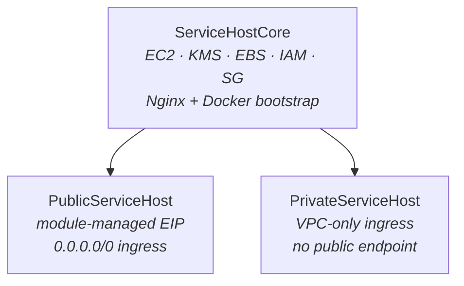

# cdk-service-host-module

A reusable AWS CDK construct library for deploying Dockerized services on EC2. You hand it a VPC and a container image; it provisions an encrypted, SSM-managed host running your app behind Nginx.

Written in TypeScript, published as both an npm package and generated Go bindings via JSII.

## Start Here

- [examples/README.md](examples/README.md) — consumer-facing example stacks
- [`sc-cdk-service-host-module-go`](https://github.com/Bh-an/sc-cdk-service-host-module-go) — generated Go bindings
- [`sc-ec2-go-service`](https://github.com/Bh-an/sc-ec2-go-service) — operator repo and real consumer
- [`sc-tf-service-host-module`](https://github.com/Bh-an/sc-tf-service-host-module) — aligned Terraform/Packer implementation

## Prerequisites

For source development in this repo:

- Node 22 preferred
- npm
- Go only if you want to inspect or validate the generated wrapper output

Quick local verification:

```bash
nvm use 22
npm ci
npm run verify
```

`verify` compiles TypeScript, runs tests, and generates the Go bindings.

## What This Repo Owns

- the TypeScript source of truth for the EC2 service host model
- the default Nginx/runtime/bootstrap contract used by CDK consumers
- the JSII publishing source that feeds the Go wrapper repo

It does not own:

- the Go application itself
- the Terraform implementation
- the operator/testing runbooks

Those live in the related repos linked above.

## Constructs



| Construct | Posture | Default Ingress | Elastic IP |
|-----------|---------|-----------------|------------|
| `PublicServiceHost` | Internet-facing | `0.0.0.0/0` on port 80 | Yes (module-managed) |
| `PrivateServiceHost` | VPC-internal only | VPC CIDR on port 80 | No |

Both variants share the same core resource set: EC2 instance, KMS-encrypted EBS volumes, IAM role with SSM access, security group, Nginx reverse proxy, and Docker container bootstrap.

## Configured Defaults

> [!IMPORTANT]
> **Defaults governance** — these values are load-bearing. If you change a default in code, update this table in the same commit.

| Default | Value | Source |
|---------|-------|--------|
| Instance type | `t3.micro` | `src/service-host/service-host-core.ts:143` |
| Service port (app) | `8081` | `src/service-host/service-host-core.ts:87` |
| Public port (Nginx) | `80` | `src/service-host/service-host-core.ts:88` |
| Docker bridge network | `ec2-net` at `172.30.0.0/24` | `src/service-host/service-host-core.ts:89-90` |
| Container IP | `172.30.0.10` | `src/service-host/service-host-core.ts:91` |
| Data mount path | `/data` | `src/service-host/service-host-core.ts:92` |
| Data volume device | `/dev/xvdf` | `src/service-host/service-host-core.ts:93` |
| Root volume | 30 GiB, GP3, KMS-encrypted | `src/service-host/service-host-core.ts:125-129` |
| Data volume | 10 GiB, GP3, KMS-encrypted | `src/service-host/service-host-core.ts:134-138` |
| IMDSv2 | Required | `src/service-host/service-host-core.ts:146` |
| KMS key rotation | Enabled | `src/service-host/service-host-core.ts:278` |
| Outbound traffic | Allow all | `src/service-host/service-host-core.ts:315` |
| Health check | 30 retries x 5s interval | `src/service-host/service-host-core.ts:414-424` |
| Machine image | Amazon Linux 2023, x86_64 | `src/service-host/service-host-core.ts:116-118` |

<details>
<summary>Nginx defaults</summary>

Generated by `src/service-host/default-nginx-config.ts`. Fully overridable via `nginxMainConfig` and `nginxRoutesConfig` props.

| Setting | Value | Line |
|---------|-------|------|
| `worker_processes` | `auto` | `default-nginx-config.ts:3` |
| `worker_connections` | `1024` | `default-nginx-config.ts:8` |
| `keepalive_timeout` | `65` | `default-nginx-config.ts:15` |

The default route config is strict:

- `/_nginx/health` returns a direct Nginx health payload
- `/health` proxies to the container health endpoint
- `/api/v1` proxies to the assignment API endpoint
- `/version` proxies to the app build metadata endpoint
- all other paths return `404`

</details>

## Published Paths

| Artifact | Path |
|----------|------|
| npm package | `cdk-service-host-module` (unscoped) |
| Go bindings | `github.com/Bh-an/sc-cdk-service-host-module-go/cdkservicehostmodule` |
| Container image (owned by service repo) | `ghcr.io/bh-an/ec2-go-service:<tag>` |

<details>
<summary>Consumer integration</summary>

Reference material for consumers:

- `docs/consumer-cicd.md` — CI/CD integration guidance
- `.github/workflow-templates/` — consumer deploy workflow templates
- `examples/consumer-proof-stack.ts` — validates both postures together

The consumer proof stack demonstrates:
- public path: direct `PublicServiceHost` with module-managed EIP
- private path: `PrivateServiceHost` behind an ALB, forwarding to the host's Nginx listener

For real deployment and testing, use the operator surface in [`sc-ec2-go-service`](https://github.com/Bh-an/sc-ec2-go-service).

</details>

## Source Layout

```text
src/
  contracts/
    platform-service.ts      Shared types, identity resolution, tag helpers
  service-host/
    public-service-host.ts   PublicServiceHost construct
    private-service-host.ts  PrivateServiceHost construct
    service-host-core.ts     Core resource factory
    default-nginx-config.ts  Nginx config generators
    types.ts                 Ingress and operational controls
  index.ts                   Public exports
```

## Current Release

`v0.3.3`

> [!NOTE]
> Live-verified via the service repo's public CDK deployment path on `2026-03-27`.

## Contributing

See [CONTRIBUTING.md](CONTRIBUTING.md).
